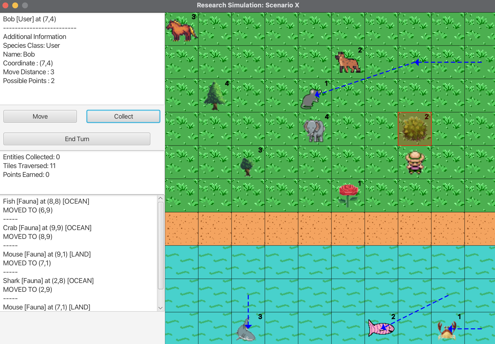

# Resarch Simulation 

This Java desktop application allows researchers to simulate the observation and collection of flora/fauna in different habitats. It provides an interactive graphical user interface (GUI) built with JavaFX, enabling researchers to conduct simulations easily.



## Usage

1. Clone the repository to your local machine:

```bash
git clone https://github.com/hcmgr/research_sim.git
```

2. Ensure you:
    - have an SDK with JavaFX pre-installed (ie: Zulu 11 from Azul) or are able to install it yourself
    - have JUnit 4 added to your class path
    - are using an SDK compatible with Java 11

3. Include the following in your CLI arguments:

```bash 
saves/{your_scene_file}
```

where:
- 'your_scene_file' is the .txt file you wish to load into the simulation (see Scene File Format)
- NOTE: scen1.txt and scen2.txt already provided for testing/experimentation

4. Run Launcher.java

## Scene File Format ##
```
 {ScenarioName}
 Width:{Width}
 Height:{Height}
 Seed:{Seed}
 {Separator}
 {map}
 {Separator}
 {entity}
 {entity...}
```
    where:
        - 5 <= Width,Height <= 15
        - seed > 0
        - Separator - '=' * Width (eg: Width 5 -> =====)
        - Map - (See examples)
        - Entity - (See examples)

Example scene (saves/large_scene.txt)
```
Scenario X
Width:10
Height:10
Seed:1
==========
LLLLLLLLLL
LLLLLLLLLL
LLLLLLLLLL
LLLLLLLLLL
LLLLLLLLLL
LLLLLLLLLL
SSSSSSSSSS
OOOOOOOOOO
OOOOOOOOOO
OOOOOOOOOO
==========
Fauna-SMALL-9,9-OCEAN
Fauna-LARGE-2,8-OCEAN
Fauna-LARGE-0,0-LAND
Fauna-GIANT-4,3-LAND
Fauna-MEDIUM-8,8-OCEAN
Fauna-MEDIUM-5,1-LAND
Fauna-SMALL-9,1-LAND
Flora-SMALL-5,5
Flora-MEDIUM-7,3
Flora-LARGE-2,4
Flora-GIANT-1,2
User-7,4-Bob
```